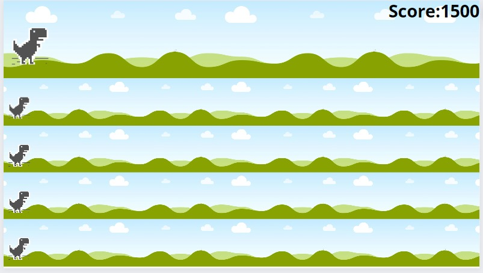
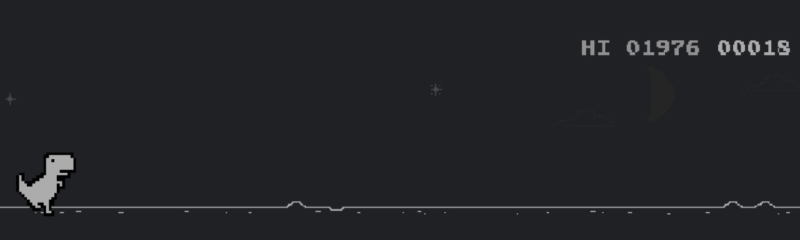
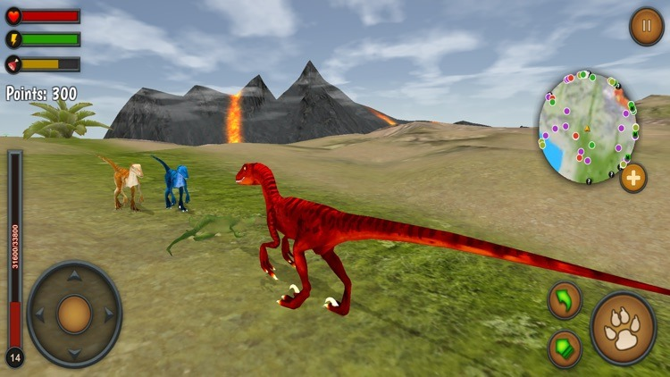
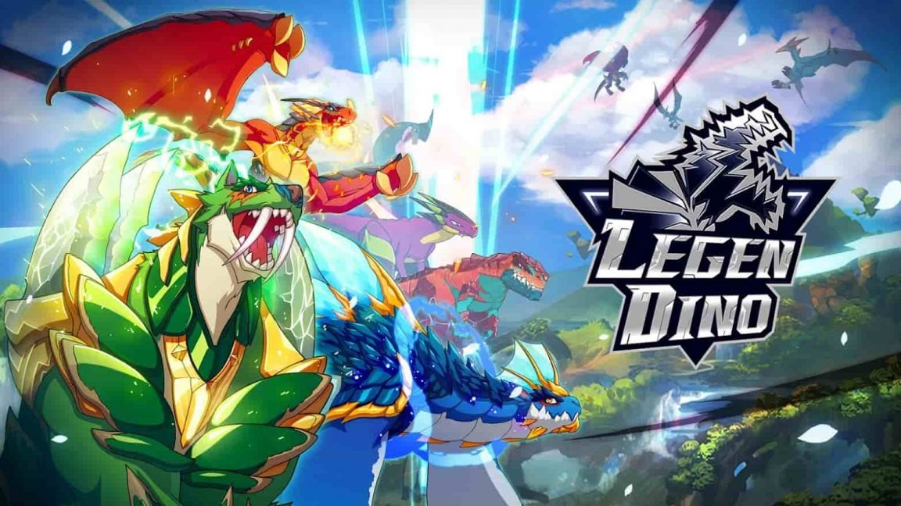

# DinoPower

Este proyecto está destinado a coger como base el juego de Google Chrome Dinosaur Game,  el cual consiste en un juego multijugador  en tiempo real, que utiliza la concurrencia para obtener poderes que aparecerán a lo largo del camino (solo el primer jugador que obtenga dicho poder tendrá la capacidad de usarlo) y el primer jugador que pase por los diferentes puntos de control tendrán una bonificación en su puntaje total, estos puntajes se guardarán y podrán ser utilizados para desbloquear nuevos personajes

Nuestra opción multijugador tiene un máximo de cinco integrantes los cuales se podrán unir a la partida a través de la creación de salas privadas usando un código QR generado por la aplicación.

Este sería nuestro prototipo hasta el momento de la visualización en pantalla del juego en modo multijugador

## Descripción

Nuestra propuesta está basada en Dinosaur Game de Google, el cual es un juego de navegador desarrollado por Google y construido en el navegador web Google Chrome. El jugador guía a un Tiranosaurio Rex pixelado a través de un paisaje de desplazamiento lateral, evitando obstáculos para lograr una puntuación más alta. El juego fue creado por miembros del equipo de Chrome UX en 2014. El juego se puede jugar sin conexión a Internet y se puede acceder presionando la barra espaciadora o ↑ en la computadora de escritorio, o tocando el dinosaurio en dispositivos móviles Android o iOS. Este será el juego que realizará cada jugador en su pantalla, pero Dino Power podrá permitir el uso de poderes, puntos de control y la opción multijugador.

Adicionalmente, existen muchos juegos multijugador que usan poderes y compiten en tiempo real, como nuestro proyecto, algunos de estos juegos son:

- **Raptor World Multiplayer:** Este es un simulador de dinosaurios que permite a los jugadores jugar en línea contra otros jugadores de todo el mundo. Incluye acción en tiempo real, mapas sin conexión para construir experiencia y magia, y la capacidad de mejorar tus habilidades para tener una mejor oportunidad de ganar. A diferencia de este juego, nuestro proyecto es un poco más pequeño, porque solo se podrán usar salas privadas, no públicas ni permitirá contacto con jugadores que no se conozcan.

- **Legendino:** Este juego permite a los jugadores criar 162 tipos de dinosaurios legendarios, incluyendo Stegosaurus y Tyrannosaurus. Los jugadores pueden comer "alimento para dinosaurios" para subir de nivel rápidamente y combinar 27 habilidades diferentes para activar habilidades únicas. A diferencia, de este juego, nuestro proyecto usa el puntaje acumulado obtenido para obtener nuevos personajes que podrán ser usados en las carreras; y las habilidades para nuestro caso, serían los poderes que se obtienen en la carrera, no estarían asociadas a los personajes.

## Integrantes
Proyecto realizado por el equipo Multi-Rex integrado por
Andrea Durán, Camilo Fajardo y Sebastian Rojas

## Bibliografía

Arora, S. (2021, julio 20). Legendino for PC – download & play on PC [windows / mac]. Desktop Gamer. https://desktopgamer.net/games/adventure/legendino-for-pc/

Chrome Dino game online. (s/f). Dino-chrome.com. Recuperado el 15 de septiembre de 2023, de https://dino-chrome.com/en

De docentes y discentes, C. y. P. (s/f). La evaluación para el aprendizaje de la interpretación de conferencias. Tdx.cat. Recuperado el 15 de septiembre de 2023, de https://www.tdx.cat/bitstream/handle/10803/317965/lda1de1.pdf?sequence=1

Dino Game. (s/f). Poki.com. Recuperado el 15 de septiembre de 2023, de https://poki.com/es/g/dinosaur-game

Dinosaur T-Rex game. (s/f). Chrome_Dino. Recuperado el 15 de septiembre de 2023, de https://dinorunner.com/

Wikipedia contributors. (2023, septiembre 3). Dinosaur Game. Wikipedia, The Free Encyclopedia. https://en.wikipedia.org/w/index.php?title=Dinosaur_Game&oldid=1173677201

(S/f-a). Cloudfront.net. Recuperado el 15 de septiembre de 2023, de https://d1qbemlbhjecig.cloudfront.net/prod/filer_public/kvcr-bento-live-pbs/education/3cc7371a89_All%20Spanish%20Lessons.pdf

(S/f-b). Appadvice.com. Recuperado el 15 de septiembre de 2023, de https://appadvice.com/app/raptor-world-multiplayer/1191463882

(S/f-c). Chromedino.com. Recuperado el 15 de septiembre de 2023, de https://chromedino.com/

